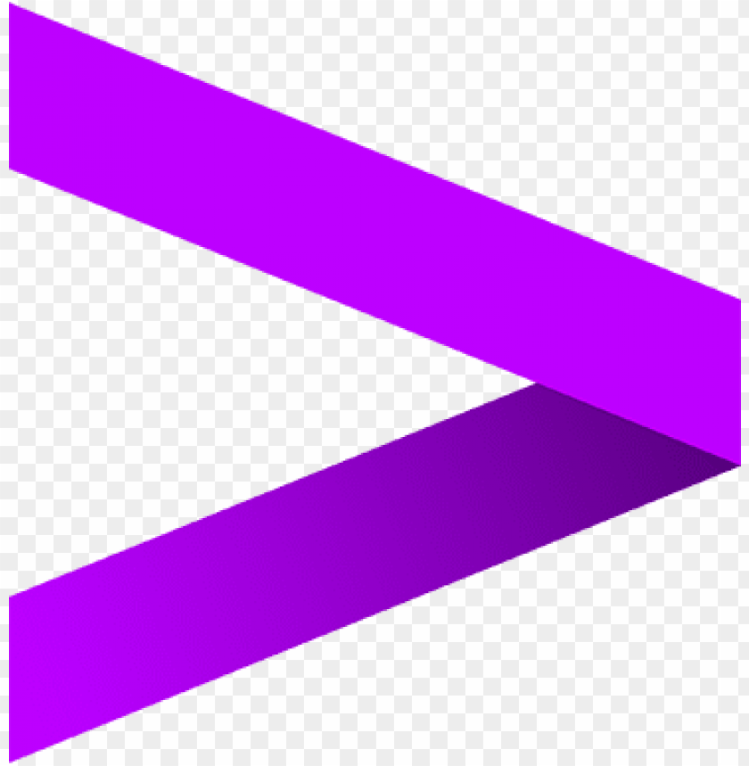

### Hello World 👋

- 🔭 I’m graduate at UC Berkeley,focusing on Product Management, Privacy and Data Science.
- 🎥 I have previously worked as Product Manager and Technical Program Manager/Software Engineer with Yubico and Accenture respectively. 
- 🌱 I’m currently exploring  Data Privacy, CyberSecurity and Analytics.
- 👯 I’m always looking to collaborate on interesting projects/ideas
- 💬 Ask me about History/Politics/Philosophy, French, Japanese, Birding and Privacy! Let's learn and share!
- 📫 How to reach me:
- 😄 Pronouns: He/him/his
- ⚡ Fun fact:
---I can solve 3*3 Rubix Cube and Mirror Cube learning to solve Ghost Cube. Big Time Geography Buff, Stamp (philatelist) and Coin Collector.
---I won university level quiz competition twice in undergrad and photography competition once. 
---Our team won national level "Best Aesthetics Robot" for Robotics competition beating 130 teams, we were state level champions.

  

   

#### My Working Stack:

    
      
    
    
    
    
    
    
    
    

